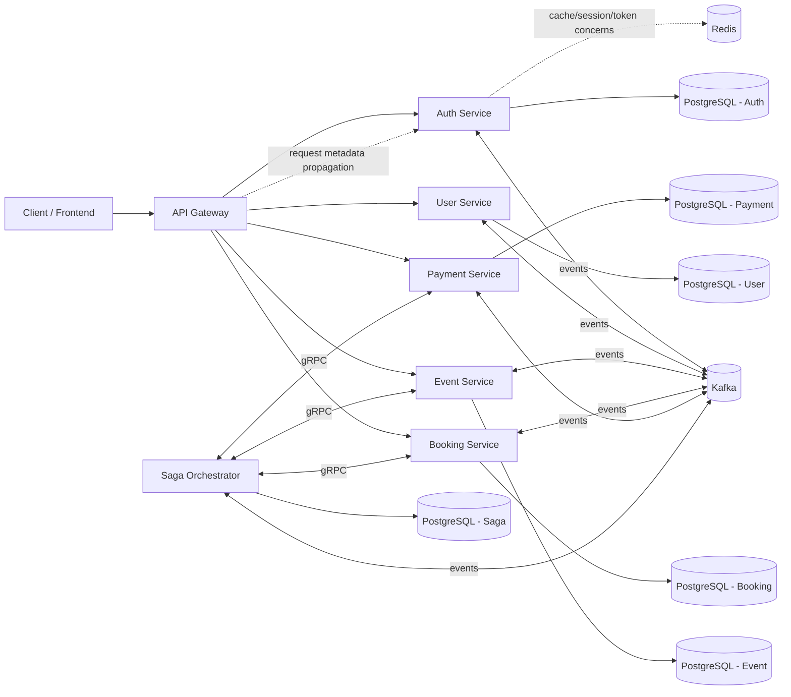
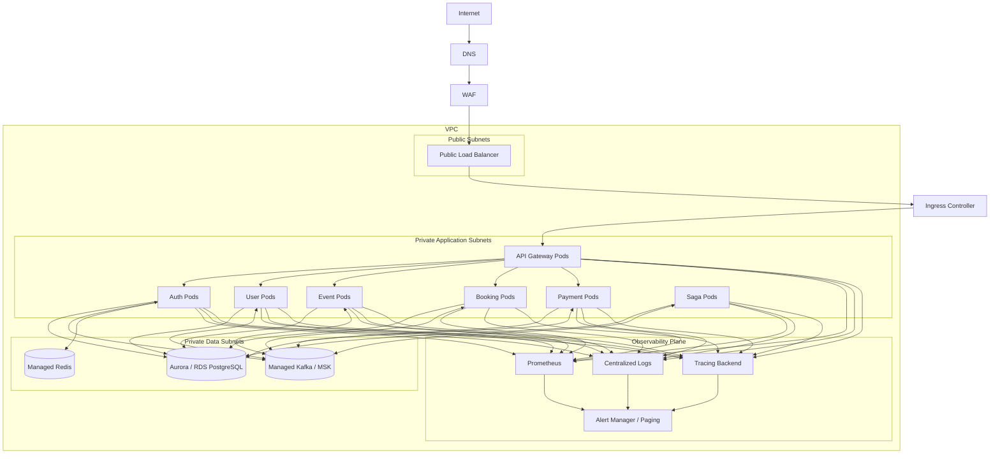

# Event Booking Platform Microservices

Distributed event-booking backend built around bounded-context services for identity, catalog, booking, payment, and orchestration. The system uses an API gateway for north-south traffic, Kafka for asynchronous coordination, gRPC for low-latency internal RPC, and PostgreSQL-backed Prisma models per service.

## Executive Summary

This repository implements a modular event-booking platform optimized for local iteration and structured for eventual production hardening. It is designed around explicit service boundaries:

- the API gateway terminates client traffic, applies coarse-grained protection, and forwards requests downstream
- domain services own business capabilities and persistence boundaries
- Kafka decouples workflow progression from request latency
- gRPC handles internal service-to-service calls where typed contracts and lower overhead matter
- saga-style orchestration provides a practical model for booking and payment flows that span multiple services

This is not a monolith disguised as services. The architecture is intentionally moving toward a production model where failure isolation, horizontal scaling, contract governance, and operational clarity matter more than local convenience.

## Core Capabilities

- Authentication, token lifecycle, and password reset flows
- User profile and identity boundary
- Event and seat inventory management
- Booking lifecycle management, including manual confirm/cancel/expire endpoints
- Payment initiation, webhook processing, and manual refund flow
- Saga-based workflow coordination across booking, event, and payment domains
- Shared gRPC contracts and cross-cutting utilities through the `utils` package

## Current Booking And Payment Lifecycle

The implemented flow in the current codebase is:

1. `POST /api/v1/booking` creates a booking in `PENDING`, inserts `BookingSeat` rows, and writes `booking.created` to the booking outbox.
2. `POST /api/v1/payment/:bookingId/initiate` enters through `payment-service`, but the distributed transaction is now executed by `saga-orchestrator-service`.
3. The payment-init saga validates booking ownership and state, locks seats through `event-service`, updates the booking to `PAYMENT_INITIATED`, and creates the payment through `payment-service`.
4. Razorpay webhook success writes `payment.success`, and the payment consumer confirms the booking and seats.
5. Razorpay webhook failure writes `payment.failed`, and the payment consumer cancels the booking and releases seats.
6. `POST /api/v1/payment/:paymentId/refund` refunds a successful payment, writes `payment.refunded`, and the payment consumer cancels the booking and bulk releases seats.
7. `POST /api/v1/booking/:id/confirm`, `POST /api/v1/booking/:id/cancel`, and `POST /api/v1/booking/:id/expire` provide explicit recovery and operator lifecycle controls.

This repository also now implements `event-service` gRPC `FindEventsByIdsWithSeats`, which the booking read APIs use for enrichment.

## Technology Stack

- TypeScript
- Node.js + Express
- Prisma
- PostgreSQL
- Redis
- Kafka
- gRPC
- Docker Compose for local development

## Unique Engineering Value

The primary differentiator of this codebase is architectural separation rather than a published benchmark target. It combines:

- event-driven coordination for cross-service workflows
- synchronous HTTP ingress for client simplicity
- gRPC for internal service efficiency
- isolated data ownership per service

This is the right foundation for a platform that must evolve toward higher throughput, stricter SLOs, and safer operational independence over time.

No validated throughput, latency, or availability benchmark is currently checked into the repository. Production SLOs should be established from telemetry and load testing, not from README claims.

## System Architecture



## Why This Architecture

### Why microservices instead of a monolith

The domain naturally decomposes into services with different change rates and operational concerns:

- auth changes around identity, token, and session workflows
- event inventory changes around seat state and event lifecycle
- booking and payment are workflow-heavy and failure-sensitive
- orchestration needs a separate control plane for cross-service coordination

Keeping these boundaries independent reduces blast radius and avoids forcing all teams to ship the same artifact for unrelated changes.

### Why event-driven coordination instead of synchronous chaining only

Booking, payment, and seat allocation span multiple services and cannot rely on a single database transaction. Kafka provides a durable backbone for workflow progression, retries, and eventual consistency. This is preferable to deep synchronous call chains because it:

- reduces end-to-end coupling
- improves failure isolation
- supports replay and auditability
- enables compensating actions via saga patterns

### Why gRPC inside the boundary

Internal service-to-service calls between orchestrator and domain services are gRPC-backed, which is a reasonable trade-off for:

- lower overhead than JSON/HTTP for internal traffic
- explicit, versionable contracts
- generated types shared through `utils/src/grpc`

### Why an API gateway

The gateway centralizes:

- route discovery
- request forwarding
- coarse authentication
- request metadata propagation
- rate limiting

This keeps client-facing concerns out of each domain service and creates a clean ingress point for future features such as TLS termination, WAF integration, request shaping, and centralized telemetry.

## Service Boundaries

| Service | Responsibility | Interface Style |
| --- | --- | --- |
| `api-gateway` | Public ingress, auth middleware, proxying, request metadata propagation | HTTP |
| `auth-service` | Sign-up, sign-in, token lifecycle, password reset flows | HTTP + Kafka |
| `user-service` | User domain operations and user lookup contract | HTTP + gRPC + Kafka |
| `event-service` | Events, seats, and inventory state | HTTP + gRPC + Kafka |
| `booking-service` | Booking creation and booking lifecycle | HTTP + gRPC + Kafka |
| `payment-service` | Payment creation, webhook processing, outbox-style event publishing | HTTP + gRPC + Kafka |
| `saga-orchestrator-service` | Cross-service workflow coordination and compensation path | HTTP + gRPC + Kafka |
| `utils` | Shared middleware, logging, Kafka helpers, gRPC contracts, auth helpers | Shared library |

## Local Setup Versus Production Architecture

This repository is intentionally optimized for local developer speed today. Production has very different requirements around security, operability, change safety, and fault tolerance.

| Concern | Local Development | Production Target |
| --- | --- | --- |
| Runtime | `docker-compose.yml` on a single developer machine | Kubernetes on EKS/GKE or another managed orchestrator |
| Container behavior | Bind mounts + `nodemon` hot reload | Immutable images, rolling or canary deployment |
| Ingress | Direct gateway container exposure on `localhost:3000` | WAF + external load balancer + ingress controller |
| Network isolation | Single Docker bridge network | Public and private subnets, security groups, egress controls |
| Service discovery | Docker DNS | Kubernetes service discovery + service mesh or internal DNS |
| Authentication | Service-owned JWT flow and env-based secrets | OIDC for workforce and platform identity, workload IAM, KMS-backed secrets |
| Authorization | Application-layer auth checks | Defense in depth with IAM, network policies, and application RBAC |
| Secrets | `.env` files loaded by Compose | Managed secrets with rotation, audit trails, and short-lived credentials |
| Database | Single local PostgreSQL container | Managed PostgreSQL or Aurora/RDS with Multi-AZ, PITR, and connection pooling |
| Cache | Single local Redis container | Managed Redis with replication, persistence, and failover |
| Messaging | Single local Kafka broker | Managed Kafka or multi-broker Kafka with replication and partition planning |
| Schema changes | Manual `prisma:migrate:dev` during development | Backward-compatible migrations, `prisma migrate deploy`, release-gated rollout |
| Logging | Shared console logger | Structured JSON logging, centralized aggregation, trace correlation |
| Metrics | Not implemented yet | Prometheus metrics, SLI dashboards, alerts, burn-rate policies |
| Tracing | Not implemented yet | OpenTelemetry traces across HTTP, Kafka, gRPC, and DB spans |
| Health | Basic `/health` endpoints | Liveness, readiness, dependency health, and synthetic checks |
| Resilience | Best-effort retries inside code paths | Timeouts, circuit breaking, DLQs, autoscaling, and fault budgets |
| Delivery | Manual `docker compose up` | CI/CD with canary or blue-green deployment and automated rollback |
| Infra changes | Manual file edits | Terraform/CDK with reviewed plans and remote state |

## Production Deployment Diagram

The following diagram represents a target production topology. It is not the current local deployment.



## Performance And Scalability

### Current scaling model

The repository is structurally positioned for horizontal scaling because most services are stateless outside their owned datastores and message subscriptions.

Key enablers already present:

- API gateway as a single ingress abstraction
- per-service data ownership
- Kafka-based asynchronous coordination
- gRPC for low-overhead internal service communication
- health endpoints on gateway and downstream services

### Expected bottlenecks

The most likely scaling constraints are:

- PostgreSQL write contention for booking, event seat state, and payment status transitions
- Kafka single-broker local topology, which is fine for development but not for resilience
- payment webhook burst handling and downstream idempotency
- seat-locking correctness under concurrent booking attempts
- gateway saturation if request fan-out or auth verification becomes expensive

### Scaling strategy

For production, the recommended strategy is:

1. Keep the gateway stateless and scale it horizontally behind a load balancer.
2. Scale domain services independently based on CPU, memory, queue lag, and p95 latency.
3. Partition Kafka topics using business keys such as booking ID or event ID where ordering matters.
4. Add targeted indexing, query analysis, and lock profiling for booking and inventory hotspots.
5. Introduce idempotency keys and deduplication around payment and booking transitions.
6. Add explicit backpressure, bounded retries, and dead-letter handling for asynchronous consumers.

### Throughput posture

The architecture can support higher throughput than a tightly coupled monolith, but this repository does not currently include benchmark harnesses or SLO validation. Before making throughput claims, add:

- load testing scenarios for booking bursts
- queue lag dashboards
- database lock analysis
- p50, p95, and p99 latency measurements
- failure-injection tests for Kafka, Redis, and database degradation

## Getting Started

The local setup is optimized for containerized development with hot reload enabled for all services.

### Prerequisites

- Docker Desktop with Compose v2
- Available ports for the gateway and supporting infrastructure
- Service-level `.env` files present for:
  - root `.env`
  - `api-gateway/.env`
  - `auth-service/.env`
  - `user-service/.env`
  - `event-service/.env`
  - `booking-service/.env`
  - `payment-service/.env`
  - `saga-orchestrator-service/.env`

Node.js is optional for local development because the standard workflow runs inside Docker.

### Quickstart

Build and start the local environment:

```powershell
docker compose up -d --build
```

Follow service logs:

```powershell
docker compose logs -f gateway auth user event booking payment saga-orchestrator
```

The public ingress is exposed through the API gateway on:

```text
http://localhost:3000
```

### Local Development Workflow

The current Compose setup uses bind mounts and `nodemon` for hot reload.

- edit service code under `src`
- the relevant service restarts automatically
- changes in shared `utils/src` also trigger reloads

You do not need to rebuild containers for normal TypeScript edits.

Recreate containers only when startup configuration changes:

```powershell
docker compose up -d --force-recreate gateway auth booking event payment saga-orchestrator user
```

### Environment Configuration

This project uses a combination of root-level and service-level environment files.

At minimum, define:

- database URLs per service
- Kafka broker addresses
- JWT secrets
- Redis credentials
- external provider credentials for payment and email flows

For local development, `.env` files are loaded directly by Compose. For production, move all secrets to a managed secret store.

### Prisma Workflow In Containers

Prisma is intentionally decoupled from the hot reload loop.

Normal application coding:

- edit TypeScript
- let hot reload restart the process
- do not run Prisma commands

When `schema.prisma` changes and only the Prisma client needs regeneration:

```powershell
docker compose exec <service> npm run prisma:generate
```

When the actual database schema changes:

```powershell
docker compose exec <service> npm run prisma:migrate:dev
```

For production, use `prisma migrate deploy` during release workflows instead of `prisma migrate dev`.

## API And Health Endpoints

### Gateway routes

The gateway currently proxies these service prefixes:

- `/auth-service`
- `/user-service`
- `/event-service`
- `/booking-service`
- `/payment-service`

### Health checks

The repository already exposes health endpoints such as:

- `GET /health` on `api-gateway`
- `GET /health` on each downstream service

These are adequate for local liveness checks, but production should distinguish:

- liveness
- readiness
- dependency health
- synthetic business-journey health

### Booking and payment endpoints

Important lifecycle endpoints currently implemented behind the gateway include:

- `POST /booking-service/api/v1/booking`
- `GET /booking-service/api/v1/booking`
- `GET /booking-service/api/v1/booking/:id`
- `POST /booking-service/api/v1/booking/:id/confirm`
- `POST /booking-service/api/v1/booking/:id/cancel`
- `POST /booking-service/api/v1/booking/:id/expire`
- `POST /payment-service/api/v1/payment/:bookingId/initiate`
- `POST /payment-service/api/v1/payment/:paymentId/refund`
- `POST /payment-service/api/v1/payment/webhook/razorpay`
- `GET /payment-service/api/v1/payment/:id`
- `GET /payment-service/api/v1/payment/bookings/:id`

## Observability And Health

### Current state

The codebase already includes:

- service-level health endpoints
- gateway request forwarding logs
- request ID propagation through the gateway
- basic Prisma query timing logs
- application logging through a shared logger abstraction

### Required production observability

To meet modern production expectations, add:

1. Prometheus metrics
2. Structured JSON logging
3. Distributed tracing through OpenTelemetry
4. Dependency-aware readiness checks
5. Alerting based on symptoms, not just host metrics

### Recommended baseline metrics

Track at minimum:

- request count, error rate, and latency by route and service
- Kafka consumer lag by topic and partition
- retry rate and DLQ rate for asynchronous handlers
- Prisma query latency and connection pool saturation
- webhook acceptance rate and payment reconciliation lag
- container restarts, OOM kills, CPU saturation, and memory pressure

## Operational Excellence

### Service Health Objectives

The following are recommended initial SLI/SLO targets for a first production rollout. They are targets, not current measured guarantees.

| Capability | Primary SLI | Initial SLO Target | Alerting Threshold |
| --- | --- | --- | --- |
| API gateway availability | Successful HTTP requests / total requests | 99.9% over 30 days | Page if burn rate exceeds 2x budget over 1 hour |
| Auth latency | p99 latency on sign-in and token refresh | p99 under 300 ms | Warn at 250 ms, page at 300 ms sustained |
| Event read path | p99 latency on event and seat read APIs | p99 under 250 ms | Warn at 200 ms, page at 250 ms sustained |
| Booking write path | Successful booking initiation / attempts | 99.5% over 30 days | Page if error rate exceeds 1% sustained |
| Payment processing | End-to-end payment state convergence | 99.9% within 2 minutes | Page on queue lag or reconciliation breach |
| Kafka consumers | Consumer lag by topic group | Zero sustained unbounded lag | Page if lag exceeds threshold for 10 minutes |
| Database health | Query latency and connection saturation | p95 query latency under 100 ms | Page on pool exhaustion or lock contention spikes |

### Common Incident Runbook

#### Incident: p99 latency spike

Symptoms:

- elevated p99 latency on gateway or a domain service
- increased 5xx rates
- growing Kafka lag or database latency

First actions:

1. Identify whether the spike is isolated to one route, one service, or the entire system.
2. Check dashboard correlations across HTTP latency, Kafka lag, DB query latency, CPU, and memory.
3. Inspect recent deploys, config changes, and migration events.
4. Verify whether the issue is read-path saturation, write contention, or downstream dependency slowdown.

Mitigations:

- reduce traffic via rate shaping if the platform is overloaded
- roll back the last deploy if latency regression correlates with a release
- scale out stateless services if CPU or concurrency saturation is the cause
- shed non-critical background work if Kafka consumers are starving request-serving threads
- isolate slow queries and enable emergency indexes if database contention is root cause

Exit criteria:

- p99 returns to target band
- error rate normalizes
- queue lag returns to steady state
- incident timeline and root cause are captured

#### Incident: OOM kill or crash-loop

Symptoms:

- pod or container restarts
- degraded throughput
- sudden queue lag increase
- readiness failures after rollout

First actions:

1. Identify which service is restarting and whether the pattern started after a deploy.
2. Inspect heap growth, request volume, retry storms, and payload sizes.
3. Check whether background workers or consumers are buffering unbounded work in memory.
4. Determine whether this is a memory leak, traffic spike, or configuration regression.

Mitigations:

- roll back the latest image if the failure correlates with code change
- temporarily increase memory limits only if the change is a stopgap and leak is understood
- disable high-cardinality logging or unsafe payload logging if that caused memory growth
- reduce batch sizes and concurrency on consumers if backlog processing is causing heap pressure
- shift heavy or blocking work out of the request path

Exit criteria:

- no restart loop for one full observation window
- heap stabilizes under normal load
- queue lag and latency normalize
- post-incident memory profile captured for follow-up

## Path To Production

The current repository is a strong local-development foundation, but it is not production-ready as-is. The following changes are required before operating it in a real environment.

### Security

- move all secrets to a managed secret store with rotation and auditability
- use short-lived credentials where possible instead of static secrets
- terminate external TLS at the edge and encrypt east-west traffic with mTLS or service-mesh policy
- isolate services in private subnets and restrict data stores to private network access only
- use VPC peering or Private Link for managed dependencies where cross-network connectivity is required
- replace permissive local trust with explicit workload identity and IAM-scoped access
- add image signing, SBOM generation, and vulnerability scanning to the release pipeline

### Database Governance

- use `prisma migrate deploy` for releases, never `prisma migrate dev`
- adopt backward-compatible schema migration patterns:
  - expand
  - dual-read or dual-write when required
  - backfill
  - contract
- define backup and restore objectives explicitly
- recommended starting targets:
  - RPO: 5 minutes or better
  - RTO: 30 to 60 minutes depending on service tier
- test restore procedures regularly, not just backup creation
- review locking behavior for booking and event inventory schema changes before rollout

### Infrastructure As Code

- move environment provisioning to Terraform or CDK modules
- keep state in a remote backend with locking and audit history
- require reviewed plans before apply
- separate module boundaries for:
  - networking
  - compute
  - data stores
  - observability
  - secrets
- version infrastructure changes with the same rigor as application changes

### Reliability And Resilience

- add bounded retries with exponential backoff and jitter
- add dead-letter queues for non-recoverable event failures
- ensure all event handlers are replay-safe and idempotent
- add graceful shutdown for HTTP servers, Kafka producers, Kafka consumers, gRPC servers, and background workers
- validate service port and health-check alignment across deployment manifests
- add autoscaling policies based on CPU, memory, and queue lag

### Traffic And Networking

- place the gateway behind WAF and a managed load balancer
- add rate limiting backed by a distributed store rather than per-process memory
- add ingress policies and network policies that default to deny
- separate public and private subnets
- restrict direct access to data-plane services from the public internet

### Release Engineering

- version images immutably
- promote artifacts across environments instead of rebuilding per environment
- gate releases on tests, security scans, schema safety checks, and telemetry
- use canary or blue-green deployment for risk-heavy services such as payment and booking

## Contribution Policy

This repository should be evolved with an engineering-first contribution model.

### Testing standards

Every meaningful change should map to one or more of:

- Unit tests for deterministic business rules and helpers
- Integration tests for service boundaries, Prisma repositories, Kafka flows, and gRPC contracts
- End-to-end tests for booking and payment journeys through the gateway

### CI/CD philosophy

CI should reject changes that do not meet contract, correctness, and operability requirements.

A production-grade pipeline should include:

1. lint and type-check gates
2. unit and integration test execution
3. contract verification for gRPC and event schemas
4. image build and vulnerability scan
5. migration safety checks
6. deployment promotion by environment
7. canary or blue-green rollout for production
8. automated rollback on telemetry breach

### Go or No-Go deployment gates

Production promotion should be blocked automatically when any of the following fail:

- unit or integration tests
- schema compatibility checks
- vulnerability policy checks
- error rate regression during canary
- latency regression during canary
- Kafka lag or saturation breach after deploy
- readiness instability or restart loops after rollout

Key principle: no merge should be "code complete but operationally unverified," and no production release should be "healthy enough by intuition."

## ADRs

### ADR-001: Event-driven saga over distributed transactions

Decision:

- use Kafka-backed asynchronous workflow coordination plus a saga orchestrator

Why:

- a booking flow spans inventory, payment, and booking state transitions
- distributed transactions would increase coupling and operational fragility
- eventual consistency plus compensating actions is the more resilient choice at this boundary

Trade-off:

- more moving parts
- higher observability requirements
- more care needed around idempotency and replay

### ADR-002: API gateway for north-south traffic, gRPC for east-west traffic

Decision:

- keep HTTP at the edge for client simplicity
- use gRPC internally where typed contracts and lower overhead are beneficial

Why:

- external consumers benefit from simple HTTP integration
- internal services benefit from stronger contracts and lower serialization overhead

Trade-off:

- dual protocol complexity
- stronger need for shared contract governance and telemetry correlation

## Current State Versus Target State

| Area | Current Local State | Production Target |
| --- | --- | --- |
| Runtime | Docker Compose | Orchestrated multi-environment deployment |
| Reload | Hot reload with bind mounts + `nodemon` | Immutable images |
| Secrets | `.env` files | Managed secret store with rotation |
| Metrics | Not yet implemented | Prometheus + dashboards + alerts |
| Logging | Shared logger abstraction, console output | Structured centralized logging |
| Tracing | Not yet implemented | Distributed tracing end to end |
| Health checks | Basic `/health` endpoints | Liveness + readiness + dependency-aware checks |
| Database migration | Manual dev workflow with Prisma | Controlled release-time migration deployment |
| Network | Single bridge network | Private networking, subnet isolation, controlled ingress |
| Releases | Manual local startup | Progressive delivery with automated go or no-go gates |

## Repository Notes

- `utils` is the shared contract and infrastructure package; changes there can affect multiple services
- local development has been configured so all services reload when their own source or shared `utils/src` changes
- `READ.md` or equivalent short-form operational notes may still exist, but `README.md` is the primary architectural reference

### Current verified build status

These services currently build successfully with `npm run build`:

- `api-gateway`
- `booking-service`
- `event-service`
- `payment-service`
- `saga-orchestrator-service`
- `user-service`

`auth-service` still has unrelated pre-existing build issues.

### Current known gaps

- `booking.created` is still emitted but no service consumes it.
- Booking creation still does not validate authoritative seat availability, event state, or pricing before persistence.
- `BookingSeat.seatId` is still globally unique, which blocks clean rebooking after cancelled or expired bookings.
- Refund settlement is still event-driven inside `payment-service`; it is not yet modeled as a dedicated refund saga.

## Next Engineering Steps

Recommended next milestones for this repository:

1. Add Prometheus metrics and a `/metrics` endpoint to every service.
2. Replace the logger with structured JSON output and trace correlation.
3. Add automated tests for critical booking and payment workflows.
4. Create separate `docker-compose.dev.yml` and production deployment manifests.
