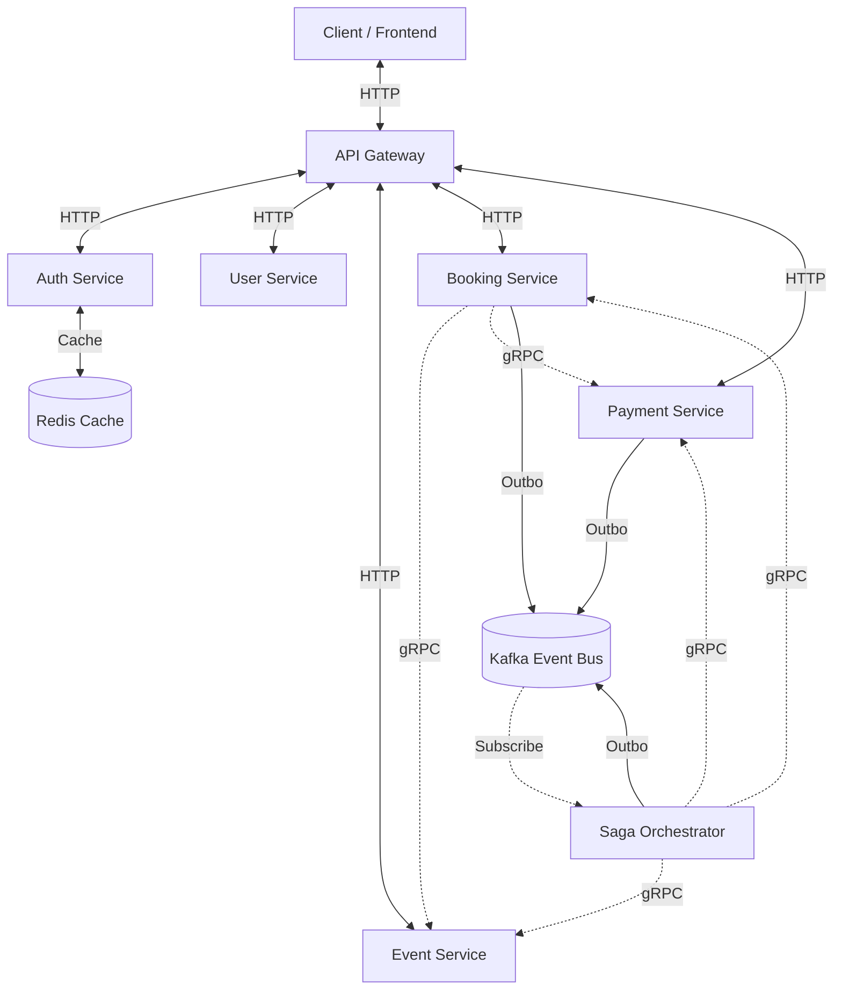
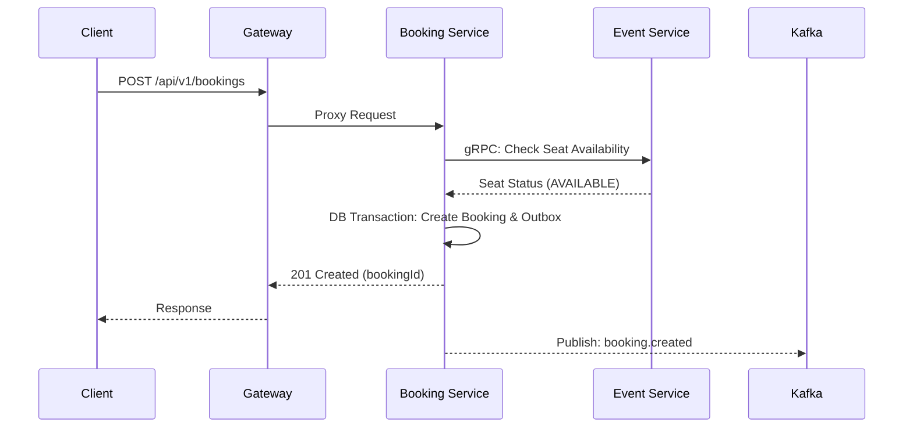
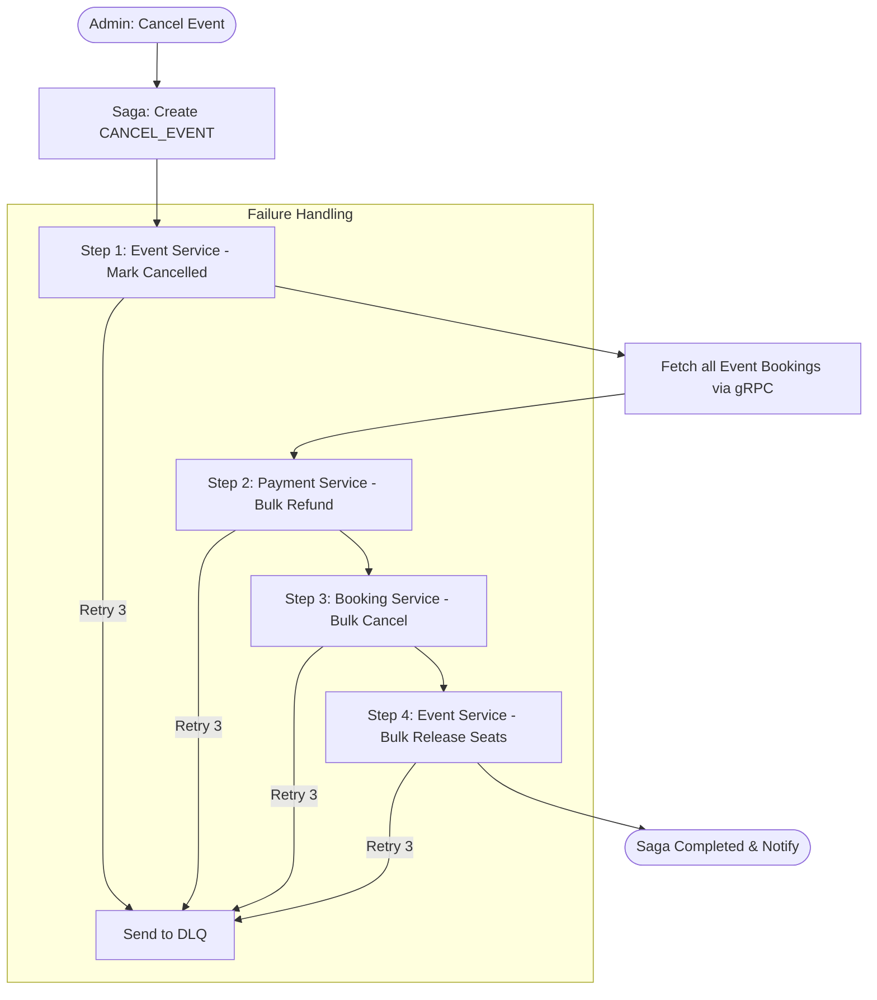

# 05 Flowcharts, Diagrams, and Impact Analysis

This document provides visual representations of the system's flows and a deep dive into the database impact of each major business operation.

## 1. System Communication Diagram

---

## 2. API Sequence Diagram (Booking Flow)

This diagram shows the end-to-end journey of a seat reservation.

---

## 3. Saga Orchestration Flow (Event Cancellation)

This flowchart illustrates the multi-service compensation logic when an event is cancelled.

---

## 4. Table Impact Analysis

This table documents which database tables are affected during core operations.

| Feature Flow | Tables Read | Tables Updated | Tables Inserted | Enums Used |
| :--- | :--- | :--- | :--- | :--- |
| **User Sign-up** | `User` (Identity check) | - | `User` | `Role` |
| **Create Booking** | `Event`, `Seat` | `Seat` (LOCKED) | `Booking`, `BookingSeat`, `OutboxEvent` | `BookingStatus`, `SeatStatus` |
| **Payment Webhook** | `Payment` | `Payment` (SUCCESS) | `PaymentEvent`, `OutboxEvent` | `PaymentStatus` |
| **Cancel Event Saga** | `Event`, `Booking`, `Payment` | `Event`, `Booking`, `Payment`, `Seat` | `Saga`, `SagaStep`, `OutboxEvent` | `SagaStatus`, `StepStatus` |
| **Booking Expiry** | `Booking`, `Seat` | `Booking` (EXPIRED), `Seat` (AVAILABLE) | `OutboxEvent` | `BookingStatus` |

### Transaction Boundaries & Race Conditions

1.  **Booking Reservation**:
    *   **Boundary**: Single microservice transaction (`Booking`) + internal gRPC calls to `Event` to lock seats.
    *   **Race Condition**: Two users booking the same seat at the exact same millisecond. 
    *   **Mitigation**: `Event Service` uses a database-level `atomic updateMany` with a status check (`where seatStatus = AVAILABLE`) to ensure only one user can claim the lock.
2.  **Payment Reconciliation**:
    *   **Boundary**: Payment Service transaction (Update Payment + Insert Outbox).
    *   **Race Condition**: Duplicate webhooks from the provider (Razorpay).
    *   **Mitigation**: Idempotency checks on `providerRef` in the `Payment Repository`.

---

## 5. Deployment Overview (Corpus Context)

The system is designed for **Dockerized Deployment**.

*   Each service has a dedicated `Dockerfile`.
*   A root-level `docker-compose.yml` orchestrates all services and the Kafka/Postgres infrastructure.
*   The `utils` module is shared as a local dependency using Node.js logic.
