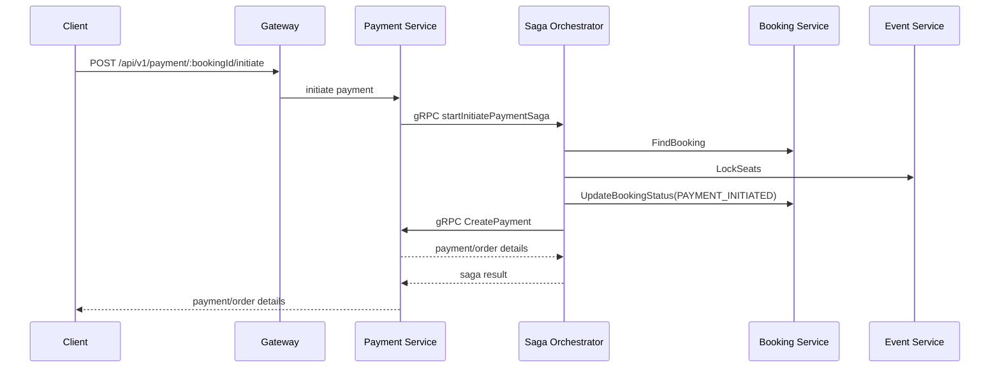
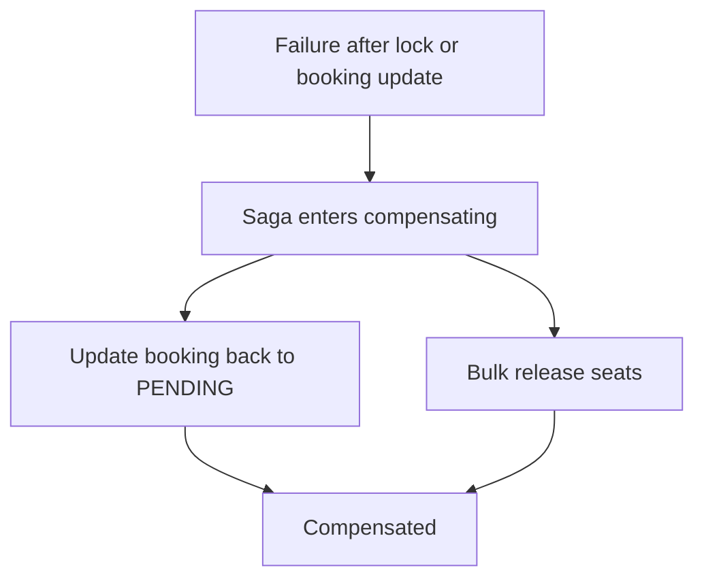
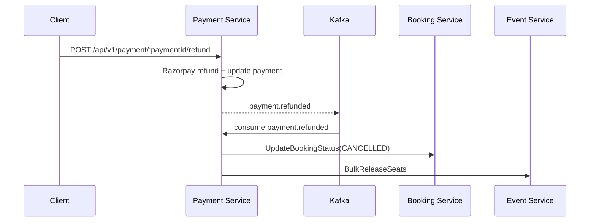

# 05 Impact And Diagrams

## Payment Initiation Saga

## Payment Initiation Compensation

## Refund Settlement

## Table Impact

| Flow | Tables Updated | Tables Inserted |
| --- | --- | --- |
| Booking create | `booking`, `bookingSeat` | `outbox_events` |
| Payment-init saga | `booking` via gRPC, `seats` via gRPC | `saga`, `saga_steps`, `payments` |
| Payment webhook success | `payments`, `booking` via consumer, `seats` via consumer | `payment_events`, `outbox_events` |
| Payment webhook failure | `payments`, `booking` via consumer, `seats` via consumer | `payment_events`, `outbox_events` |
| Refund | `payments`, `booking` via consumer, `seats` via consumer | `payment_events`, `outbox_events` |

## Current Risk Notes

- `booking.created` still has no consumer.
- Rebooking remains blocked by the current `BookingSeat.seatId` uniqueness constraint.
- Refund settlement is still not modeled as a dedicated refund saga.
