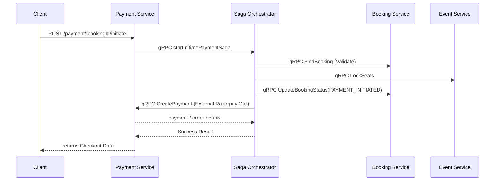
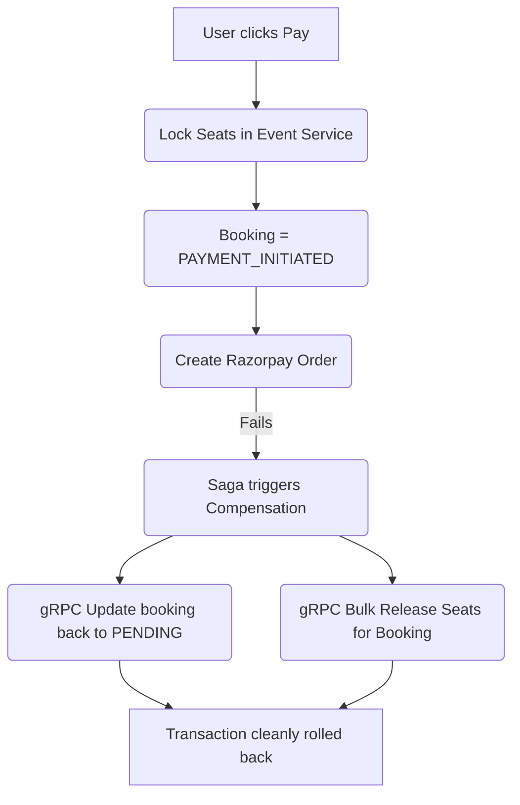
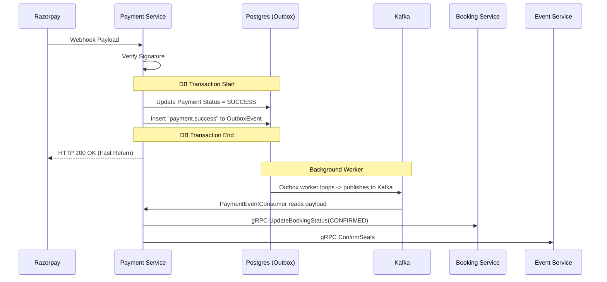
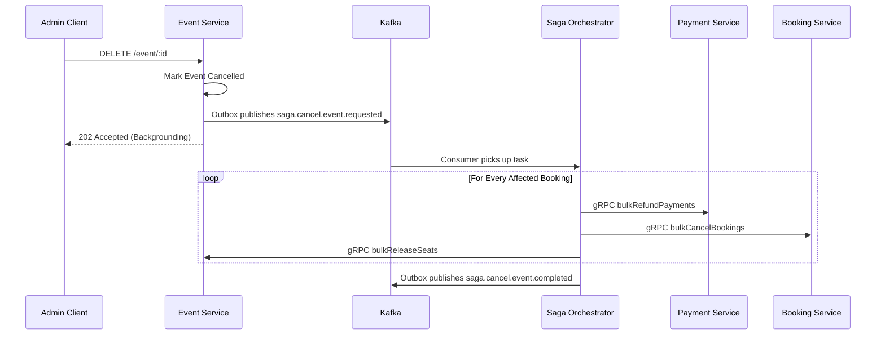

# 05 Impact and Diagrams

Visual representations of the critical system flows.

## 1. Payment Initiation (Synchronous Orchestration)

This flow is executed when the user clicks 'Pay'. It must return rapidly.

## 2. Payment Initiation Compensation (Failure Fallback)

If Razorpay goes down while the user tries to pay, we must unlock the seats immediately.

## 3. Webhook Settlement (Asynchronous Flow)

When Razorpay eventually confirms payment success, it fires a webhook.

## 4. Cancel Event Saga (Asynchronous Orchestration)

A long-running, multi-step process for admins.

## Table Impact Matrix

| Flow | Tables Updated | Tables Inserted |
| --- | --- | --- |
| Booking create | `booking`, `bookingSeat` | `outbox_events` *(for eventual observability)* |
| Payment-init saga | `booking` via gRPC, `seats` via gRPC | `saga`, `saga_steps`, `payments` |
| Payment webhook success | `payments`, `booking` via consumer, `seats` via consumer | `payment_events`, `outbox_events` |
| Payment webhook failure | `payments`, `booking` via consumer, `seats` via consumer | `payment_events`, `outbox_events` |
| Refund | `payments`, `booking` via consumer, `seats` via consumer | `payment_events`, `outbox_events` |
